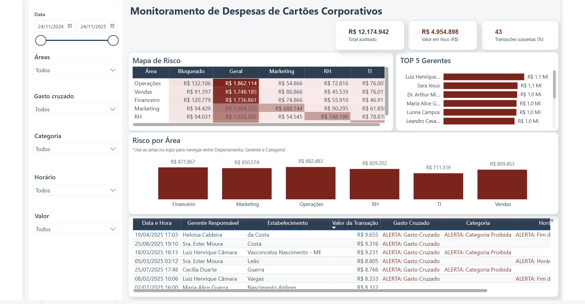

# 🛡️ Auditoria e Detecção de Anomalias em Cartões Corporativos

Projeto de **Business Intelligence e Engenharia de Dados** focada em Compliance. O objetivo foi criar um sistema automatizado para auditar despesas, detectar fraudes e identificar "Gasto Cruzado" em cartões corporativos.

## 📊 Visão Geral do Dashboard

## 🔗 Link do Dashboard Interativo
> **[Acesse a Demonstração Interativa aqui](https://youtu.be/jY7_ut8JYhw)**

## 🎯 Desafio de Negócio

Monitorar o uso de cartões corporativos distribuídos por departamentos, enfrentando dificuldades para:
1. **Identificar gastos em categorias de risco** (ex: Cassinos, Bares, Joalherias).
2. **Detectar "Gasto Cruzado"**: quando um departamento (ex: RH) utiliza verba em categorias que não lhe competem (ex: Serviços de Nuvem/TI).
3. **Monitorar padrões de comportamento suspeitos** (Transações em fins de semana, Madrugada, Valores Redondos e Duplicidades).

## 🛠️ Arquitetura da Solução (ELT)

* **Python:** Desenvolvimento de algoritmo para **Simulação de Cenários de Risco**. O script utiliza `Pandas` e `Random` para criar uma massa de dados transacional e injetar propositalmente anomalias baseadas em regras de fraude (probabilidade paramétrica).
* **PostgreSQL (Supabase):** Armazenamento em nuvem para centralização dos dados brutos e tratados.
* **SQL:** Criação de `VIEWS` de auditoria que processam cada transação e aplicam as regras de negócio para classificação de risco.
* **Power BI:** Visualização focada em "Gestão por Exceção", destacando apenas os riscos e permitindo drill-down até o nível da transação.

## 🧠 Lógica de Auditoria (SQL & Regras de Negócio)
A inteligência do projeto reside na camada de transformação, que aplica as seguintes "Flags" de risco automaticamente:

| Regra de Risco | Descrição da Lógica Aplicada |
| :--- | :--- |
| **Gasto Cruzado** | Cruza o `Departamento do Cartão` com a `Categoria do Gasto (MCC)`. Se houver divergência (ex: Marketing gastando em Peças Automotivas), gera alerta. |
| **Horário Anômalo** | Identifica transações realizadas fora do horário comercial (22h às 06h) ou em fins de semana. |
| **Valor Redondo** | Identifica valores múltiplos de 50 ou 100 (ex: R$ 500,00) que fogem da distribuição natural de preços e podem indicar saques ou gift cards. |
| **Duplicidade** | Utiliza *Window Functions* para detectar transações idênticas (mesmo valor, local e hora) processadas em sequência. |

## 📊 Estrutura da Análise
* **Matriz de Gasto Cruzado:** Heatmap para identificar vazamento de verba entre áreas de forma visual.
* **Árvore Hierárquica:** Drill-down para investigar desde o Departamento até o Gerente responsável pela despesa.
* **Detalhamento de Transações:** Relatório analítico com ícones de alerta para ação imediata da auditoria.

---
*Desenvolvido por Andressa Bortolace*
