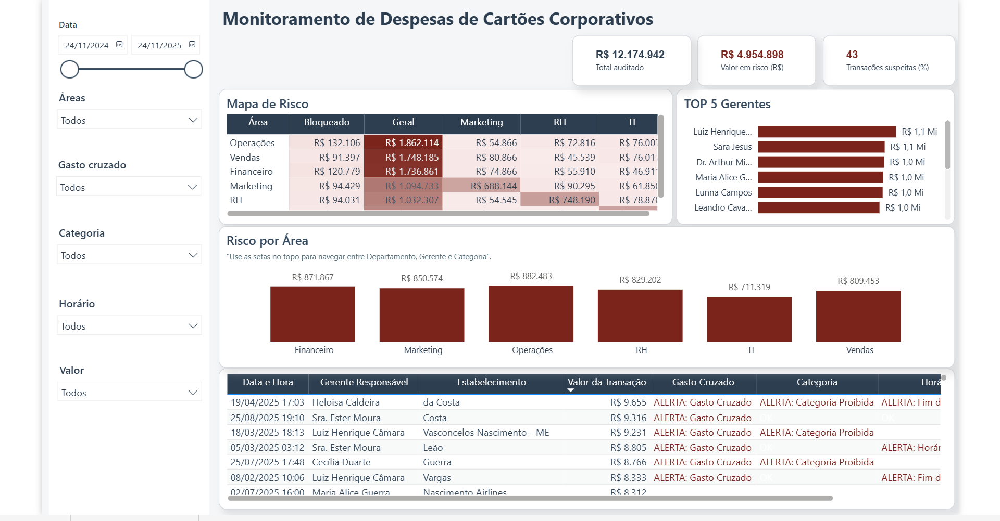

# 🛡️ Auditoria e Compliance em Cartões Corporativos

Projeto de **Business Intelligence e Engenharia de Dados** com foco em auditoria e compliance com o objetivo de criar um sistema automatizado para auditar despesas, detectar fraudes e identificar "gastos cruzados" em cartões corporativos.

## 📊 Visão Geral do Dashboard

## 🔗 Link do Dashboard Interativo
> **[Acesse a Demonstração Interativa aqui](https://youtu.be/V5S9ErWdDOc)**

## 🎯 Desafio de Negócio

Monitorar o uso de cartões corporativos distribuídos por departamentos, enfrentando dificuldades para:
1. **Identificação de gastos em categorias de risco** (ex: cassinos, bares, joalherias)
2. **Detectação de "gastos cruzados"**: quando um departamento (ex: RH) utiliza verba em categorias que não fazem parte do seu escopo (ex: serviços de nuvem/TI).
3. **Monitorarento de padrões de comportamento suspeitos** (transações em finais de semana, madrugada, valores redondos e duplicidades).

## 🛠️ Arquitetura da Solução (ELT)

* **Python:** Desenvolvimento de algoritmo para **Simulação de Cenários de Risco**. O script utiliza as bibliotecas "Pandas" e "Random" para criar uma massa de dados transacional e injetar anomalias baseadas em regras de fraude.
* **PostgreSQL (Supabase):** Armazenamento em nuvem para centralização dos dados brutos e tratados.
* **SQL:** Criação de "VIEW" de auditoria que processa cada transação e aplica as regras de negócio para classificação de risco.
* **Power BI:** Visualização em "Gestão por Exceção", destacando os riscos e permitindo drill-down até o nível da transação.

## 🧠 Lógica de Auditoria (SQL & Regras de Negócio)
A inteligência se aplica na camada de transformação, que ativa as seguintes "Flags" de risco automaticamente:

| Regra de Risco | Descrição da Lógica Aplicada |
| :--- | :--- |
| **Gasto Cruzado** | Cruza o "Departamento do Cartão" com a "Categoria do Gasto (MCC)". Se houver divergência (ex: Marketing gastando em peças automotivas), gera alerta. |
| **Horário atípico** | Identifica transações realizadas fora do horário comercial (22h às 06h) ou em finais de semana. |
| **Valor Redondo** | Identifica valores múltiplos de 50 ou 100 (ex: R$ 500,00) que fogem da distribuição natural de preços e podem indicar saques ou gift cards. |
| **Duplicidade** | Utiliza *Window Functions* para detectar transações idênticas (mesmo valor, local e hora) processadas em sequência. |

## 📊 Estrutura da Análise
* **Matriz de Gastos Cruzados:** Mapa de calor para identificar vazamento de verba entre áreas.
* **Drill-down:** Visual de barras para investigar desde o departamento até o gerente responsável pela despesa.
* **Detalhamento de Transações:** Relatório analítico com ícones de alerta para ação imediata da auditoria.

---

*Desenvolvido por Andressa*

